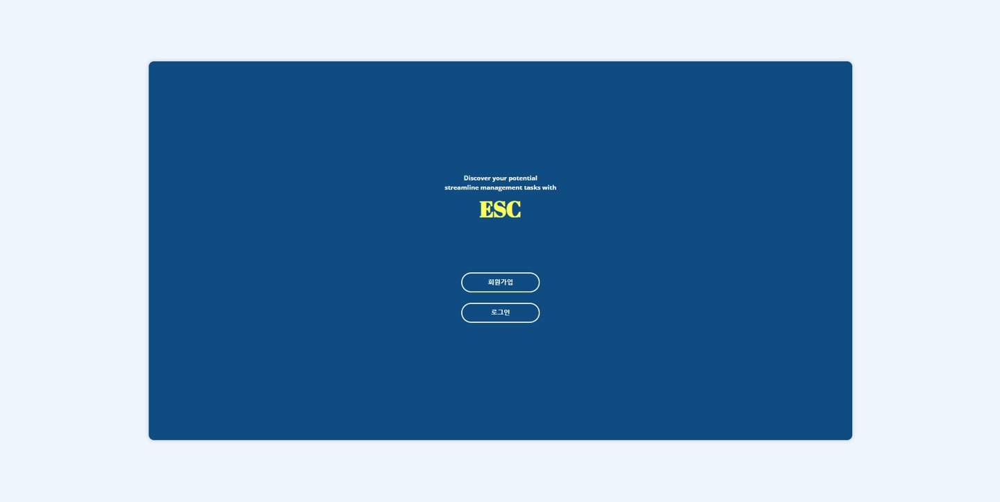
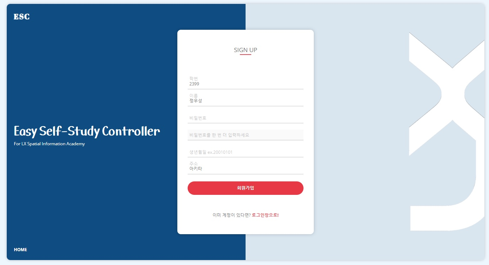
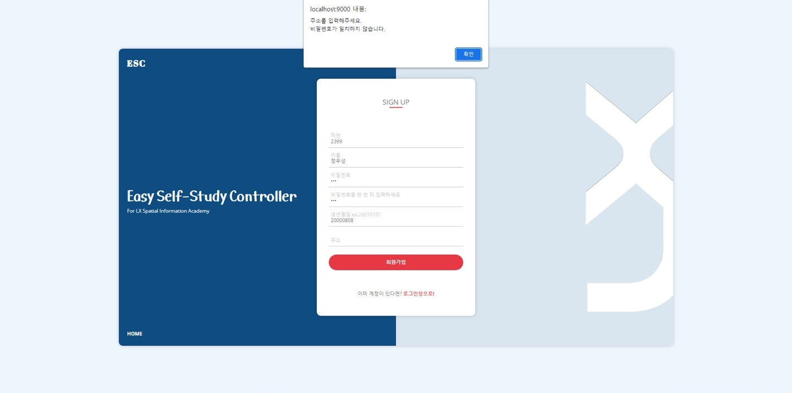
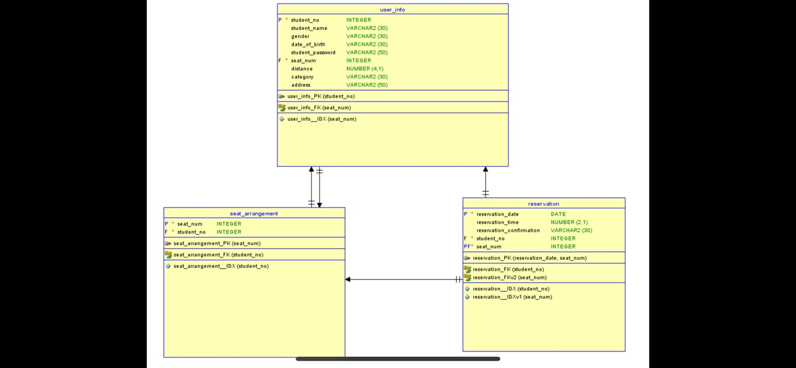

# 프로젝트 이름

  <h3 align="center">ESC(Easy Selfstudy Controller)</h3>
   
  
   

## 프로젝트 소개

<h3 align="justify">
프로젝트 개요
</h3>

현재 자습신청 시스템은 수기로 관리되고 있어 체계적인 관리가 불가능함(매번 인쇄 및 분실의 위험) 
이러한 문제점을 개선하기 위해 프로그래밍을 통해 자습 신청관리시스템 구축

<h3 align="justify">
ESC 프로그램 로직
</h3>

1. ESC프로그램 전체적인 설명
ESC의 사용자는 ‘학생’과 ‘관리자’이다.
ESC를 통해 관리자는 학생 정보와 자습 정보를 관리할 수 있다.
ESC를 통해 학생은 자습을 신청하고 자습 관련 정보(당일 자습 현황, 개인별 자습 내역)를 확인할 수 있다.
학생이 ESC 프로그램에 가입하기 위해서는 관리자가 학생 정보를 입력해야 한다. 

2. 로그인, 회원가입
관리자가 ‘학생 정보 입력’ 시 입력한 학생의 학번, 성명과 학생이 ‘회원가입’ 시 입력한 학생의 학번, 성명이 맞아야 학생 회원가입이 가능하다.
따라서 관리자의 ‘학생 정보 입력‘이 선행되어야 한다. 

3. 관리자 입장에서 사용
관리자는 ’관리자 메인 페이지‘에서 학생의 자습 신청 현황을 한눈에 확인할 수 있다. 
관리자는 ‘관리자 메인 페이지’에서 [학생 정보 입력] 버튼을 누르면 당해 학생 정보를 입력한다. 
관리자는 학생이 추가로 들어온 경우를 대비하여 새로 들어온 학생의 정보를 추가할 수 있다. 
관리자는 ‘관리자 메인 페이지’에서 [학생 정보 관리] 버튼을 누르면 관리자가 입력한 학생 정보를 관리할 수 있다. 
관리자는 학생의 주소가 바뀐 경우, 학생이 퇴소한 경우를 대비하여 수정하고 삭제할 수 있다.
관리자는 ‘관리자 메인 페이지’에서 [학생 자리 배치] 버튼을 누르면 관리자가 학생의 자리를 배치한다. 
관리자는 ‘관리자 메인 페이지’에서 [자습 내역 조회] 버튼을 누르면 일자, 훨별로 자습 내역을 확인할 수 있다.

4. 학생 입장에서 사용
학생은 ‘학생 메인 페이지’에서 ‘자습신청’ 버튼을 누르면 본인 자리에서 자습을 신청할 수 있다. 
학생은 저녁 18시부터 24시까지 자습을 신청할 수 있으며 가장 늦게까지 남는 학생이 자동으로 마감담당자가 되게 하는 기능을 구상했다. 
이때 가장 늦게까지 남는 학생의 card라는 컬럼에 ‘Y’값을 부여하여 해당일의 마감담당자임을 알려주려 했지만 배우지 않은 기술을 사용해야 해서 이 기능을 제외하고 나머지 기능들을 구현했다. 
신청 버튼을 누르면 본인 자리에 신청이 되기 때문에 관리자의 학생 자리 배치가 선행되어야 한다. 
학생은 ‘학생 메인 페이지’에서 [자습시간수정] 버튼을 누르면 자습신청 시간을 수정할 수 있다. 
학생은 ‘학생 메인 페이지’에서 [자습철회] 버튼을 누르면 자습신청을 취소할 수 있다. 
학생은 ‘학생 메인 페이지’에서 [유의사항] 버튼을 누르면 자습 마감이 처음인 학생을 위한 마감방법을 확인할 수 있다. 

 

## 기술 스택

|    Java    |   Spring   |  JavaScript  |     CSS    |      Html    |      MySQL     |
|  :------:  | :--------: | :----------: |   :-----:  |    :------:  |    :-------:   |
|   ![java]  | ![spring]  |     ![js]    |   ![css]   |    ![html]   |     ![mysql]   |

 

## 구현 기능

### 기능 1

 회원가입 및 로그인 기능 
 - 회원가입 시 관리자가 미리 입력한 기본정보(이름, 생년월일, 성별 등)와 일치해야 회원가입 가능

  

  

### 기능 2

자습신청 시스템 
- 관리자가 학생들의 자리를 배치해준 후 학생들은 본인 자리에서만 신청 가능 
- 신청이 끝난 후에 본인 자리에 색깔이 표시되는 기능

  

  

### 기능 3

일별 / 월별 자습시간 확인 기능 
- 자습 신청 시 데이터 베이스에 개별 자습시간이 일자별로 누적되어 자동 확인 가능 
- 수기로 작성한 자습시간을 일일이 사람이 더하는 시스템 개선

  

## 데이터베이스 모델링

  

 

<!-- Stack Icon Refernces -->

[java]: ESC/images/stack/java.png
[spring]: ESC/images/stack/spring.svg
[js]: ESC/images/stack/javascript.svg
[css]: ESC/images/stack/css.svg
[html]: ESC/images/stack/html.svg
[mysql]: ESC/images/stack/mysql.svg

